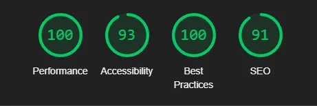

# Personal Portfolio

## Overview

This project is a responsive personal portfolio website designed to showcase your skills as a front-end developer, highlight your recent projects, and provide contact information. The site is modern, clean, and built using semantic HTML, CSS, and Bootstrap for a professional appearance.

## Features

- **Fully Responsive Design**: Adapts seamlessly to different screen sizes, desktops, tablets, and mobile devices.
- **Custom Fonts and Icons**: Google Fonts and Boxicons are integrated to enhance the visual appeal.
- **Consistent Theme**: The design uses CSS variables for colors, fonts, and spacing, ensuring a cohesive look.

## Project Structure

### 1. **index.html**

- The main HTML file that organizes the content into logical sections:
  - **Header with Navigation**: Links to Home, About, Projects, and Contact sections.
  - **Hero Section**: Features an introduction with a call-to-action button and an image.
  - **About Me Section**: Includes a brief bio and a showcase of your technical skills with icons.
  - **Projects Section**: Displays your recent projects as cards, each with an image, description, and a link to learn more.
  - **Footer Section**: Provides quick navigation links and contact details.

### 2. **style.css**

- Handles the styling for the website, including:
  - **Global Styles**: Resets, font imports, and CSS variables for easy customization.
  - **Navbar**: Sticky navigation bar.
  - **Hero Section**: Introduction with a responsive image.
  - **About Section**: Two-column layout with icons for technical skills.
  - **Projects Section**: Three-column responsive grid for project cards.
  - **Footer**: Two-column layout for navigation and contact details.

### Technologies Used

- **HTML5**: Provides the structure and semantic organization of the content.
- **CSS3**: Styles the layout, typography, and interactive elements.
- **Bootstrap 5**: Ensures a responsive design.
- **Google Fonts**: Custom fonts (`Oswald` and `Source Code Pro`).
- **Boxicons**: Adds visually consistent icons for skills and social links.

## Lighthouse Report

Lighthouse is a tool that provides insights into the performance, accessibility, SEO, and best practices of a web application. Including a Lighthouse report helps ensure your project meets high standards.

## Future Improvements

- Add animations to enhance user interaction.
- Include more projects with live demos and GitHub links.
